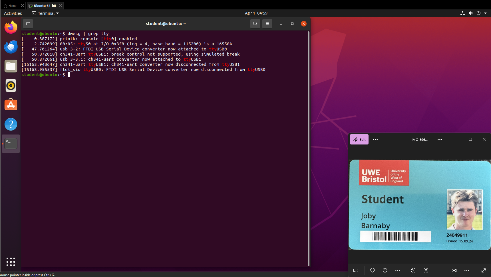
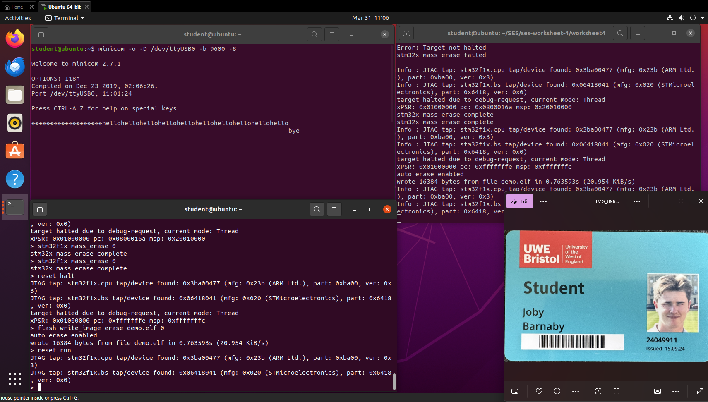
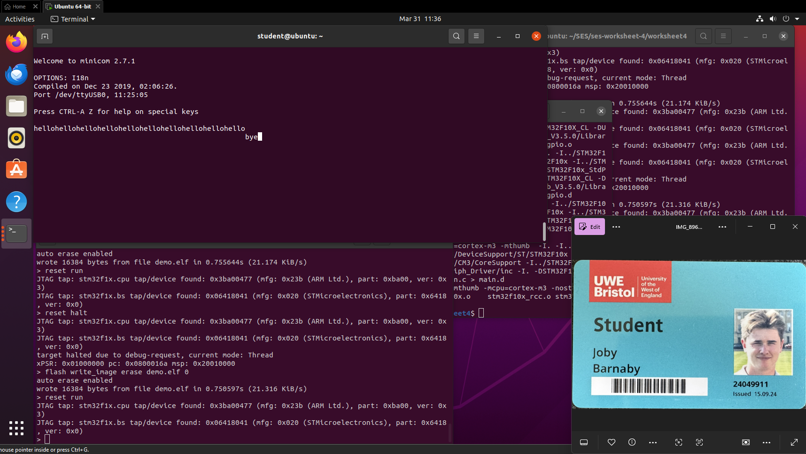
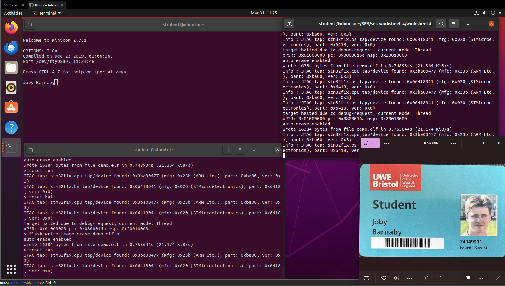
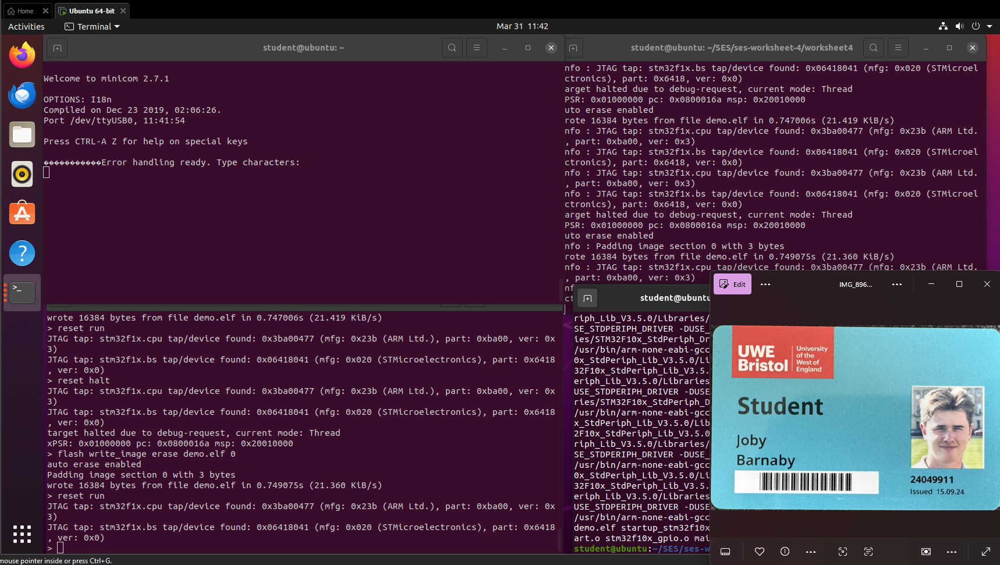

# ARM Cortex M3 | STM32P107 | Embedded Systems  
  
## Worksheet 4 — UART Communication using USART2 (Serial Interface)
  
**Student Name:** Joby Barnaby 
**Student ID:** 24049911

---
## Overview

In this lab, I implemented serial communication on the STM32F017 using USART2. the goal was to configure the UART peripheral, establish a connection to a host machine, an transmit and receive data using a serial terminal (`minicom`).

this worksheet demonstrates how embedded systems communicate with external devices, which is essential for debugging and real-world application.

---
## Background — RS-232 and USART

RS-232 is a long-established serial communication standard that is still widely used in embedded systems. On the STM32f107, serial communication handled by the USART (universal synchronous/asynchronous receiver transmitter) peripheral.

although USART supports both synchronous and asynchronous communication, in this worksheet i used it in UART (asynchronous) mode, where communication occurs without a shared clock signal. 

Because there is no clock both the STM32 and the host machine must be configured to use the same baud rate. if the baud rates do not match, the received data becomes corrupted or unreadable.

---
### Serial Data Frame Format

**Each byte is wrapped in a frame:**
```
[ Start bit | Data bits (8) | Parity bit | Stop bit(s) ]
```
- **Start bit** — signals the beginning of a transmission

- **Data bits** — the actual payload (typically 8-bit ASCII or binary)

- **Parity bit** — simple error detection (odd/even count of 1s)

- **Stop bit(s)** — marks the end of the frame

---
## USART Memory Map

In this worksheet, I worked with memory-mapped peripherals, where each USART is assigned a fixed address range in memory.

The STM32F107 provides multiple USART/UART peripherals, as shown below:

### USART Peripheral Address Map

|Peripheral|Address Range|Bus|
|---|---|---|
|USART1|0x40013800 – 0x40013BFF|APB2|
|USART2|0x40004400 – 0x400047FF|APB1|
|USART3|0x40004800 – 0x40004BFF|APB1|
|UART4|0x40004C00 – 0x40004FFF|APB1|
|UART5|0x40005000 – 0x400053FF|APB1|

For this implementation, I used **USART2**, which is connected to the **APB1 bus**.

---
## Key USART Registers

To configure and control USART2, I interacted with several key registers:

|Register|Offset|Access|Description|
|---|---|---|---|
|USART_SR|0x00|Read|Contains status flags (TX, RX, errors)|
|USART_DR|0x04|Read/Write|Used to send and receive data|
|USART_BRR|0x08|Write|Sets the baud rate|
|USART_CR1|0x0C|Write|Controls USART enable, TX, and RX|

---

## USART Status Register (USART_SR)

The status register provides flags that indicate the current state of the USART:

|Bit|Name|Description|
|---|---|---|
|7|TXE|Transmit register empty — ready to send new data|
|6|TC|Transmission complete|
|5|RXNE|Receive register not empty — data available|
|3|ORE|Overrun error (data lost)|
|2|NE|Noise error|
|1|FE|Framing error|
|0|PE|Parity error|

---

## USART Control Register 1 (USART_CR1)

This register is used to enable and configure the USART:

| Bit | Name | Description        |
| --- | ---- | ------------------ |
| 13  | UE   | USART enable       |
| 3   | TE   | Transmitter enable |
| 2   | RE   | Receiver enable    |

---
## Hardware Connections

In this setup, the USART2 transmit (TX) and receive (RX) signals are routed through a **MAX RS232C voltage level converter**. This chip is required because the STM32 operates at **3.3V logic levels**, whereas RS-232 uses higher positive and negative voltages.

The converted signals are then connected to the board’s **9-pin serial (DB9) connector**, allowing communication with a PC.

---

### Pin Connections

Based on the Olimex schematic, the relevant connections are:

|Signal|STM32 Pin|MAX RS232C Pin|
|---|---|---|
|USART2_TX|PD5|11 (T1IN)|
|USART2_RX|PD6|12 (R1OUT)|

---

### Physical Connection

To communicate with the host machine, I connected the board to the PC using a **serial connection (via DB9 or USB-to-serial adapter)**. No additional jumper wires or manual pin connections were required, as the routing is handled internally on the board.
  
---
## Repository Setup

```bash

cd ~/SES

git clone https://gitlab.uwe.ac.uk/c-duffy/ses-worksheet-4.git

cd ses-worksheet-4/worksheet4

```


---

## USART Initialisation Code

### Step 1 — Enable Clocks

First, I enabled the clocks for the relevant peripherals. USART2 is connected to the **APB1 bus**, while the GPIO port (GPIOD) and alternate function I/O (AFIO) are on **APB2**.

```c

/* Enable GPIO and AFIO clock */

RCC_APB2PeriphClockCmd(RCC_APB2Periph_GPIOD | RCC_APB2Periph_AFIO, ENABLE);

  

/* Enable USART2 clock */

RCC_APB1PeriphClockCmd(RCC_APB1Periph_USART2, ENABLE);

  

/* Remap USART2 to use PD5/PD6 instead of the default pins */

GPIO_PinRemapConfig(GPIO_Remap_USART2, ENABLE);

```
I also used pin remapping to ensure USART2 was connected to **PD5 (TX)** and **PD6 (RX)**, as required by the board layout.

### Step 2 — Configure GPIO Pins

Next, I configured the GPIO pins for transmission and reception.

```c

/* TX pin — alternate function push-pull output */

GPIO_InitStructure.GPIO_Pin = GPIO_Pin_5;

GPIO_InitStructure.GPIO_Speed = GPIO_Speed_50MHz;

GPIO_InitStructure.GPIO_Mode = GPIO_Mode_AF_PP;

GPIO_Init(GPIOD, &GPIO_InitStructure);

  

/* RX pin — floating input */

GPIO_InitStructure.GPIO_Pin = GPIO_Pin_6;

GPIO_InitStructure.GPIO_Mode = GPIO_Mode_IN_FLOATING;

GPIO_Init(GPIOD, &GPIO_InitStructure);

```
- The **TX pin** was set to _alternate function push-pull_, allowing the USART peripheral to drive the output
- The **RX pin** was configured as a _floating input_, so it can receive incoming signals without internal bias

### Step 3 — Configure and Enable USART2
Finally, I configured the USART peripheral itself.
```c

/* Configure USART: 8N1 (8 data bits, no parity, 1 stop bit) */

USART_InitStructure.USART_BaudRate            = mainCOM_PORT_BAUD_RATE;

USART_InitStructure.USART_WordLength          = USART_WordLength_8b;

USART_InitStructure.USART_StopBits            = USART_StopBits_1;

USART_InitStructure.USART_Parity              = USART_Parity_No;

USART_InitStructure.USART_HardwareFlowControl = USART_HardwareFlowControl_None;

USART_InitStructure.USART_Mode                = USART_Mode_Tx | USART_Mode_Rx;

USART_Init(USART2, &USART_InitStructure);

  

/* Commit and enable */

USART_Cmd(USART2, ENABLE);

```
I used the standard **8N1 configuration** (8 data bits, no parity, 1 stop bit) and enabled both transmission and reception.

---
## Transmit and Receive Functions
To send and receive data, I implemented simple polling-based function using USART status flags.
 
 ---
### `__io_putchar()` — Send One Character

```c

int __io_putchar(int c) {

    /* Wait until transmit register is empty */

    while (USART_GetFlagStatus(USART2, USART_FLAG_TXE) == RESET)

    {

    }

    USART_SendData(USART2, (u16) c);

    return c;

}

```
This function waits until the transmit register is empty (**TXE flag**) before sending a character. This ensures that data is not overwritten before being transmitted.

### `__io_getchar()` — Receive One Character (Exercise 2)

```c

int __io_getchar(void) {

    /* Wait until data is received */

    while (USART_GetFlagStatus(USART2, USART_FLAG_RXNE) == RESET)

    {

    }

    return (int) USART_ReceiveData(USART2);

}

```
This function waits until data is available in the receive register (**RXNE flag**) and then reads it.

---
## Complete main.c

```c

#include "com_port.h"

#include <stm32f10x.h>

#include <stm32f10x_rcc.h>

#include <stm32f10x_gpio.h>

#include <stm32f10x_usart.h>

  

int __io_putchar(int c) {

    while (USART_GetFlagStatus(USART2, USART_FLAG_TXE) == RESET) {}

    USART_SendData(USART2, (u16) c);

    return c;

}

  

void COMPortInit(void) {

    USART_InitTypeDef USART_InitStructure;

    GPIO_InitTypeDef  GPIO_InitStructure;

  

    RCC_APB2PeriphClockCmd(RCC_APB2Periph_GPIOD | RCC_APB2Periph_AFIO, ENABLE);

    RCC_APB1PeriphClockCmd(RCC_APB1Periph_USART2, ENABLE);

    GPIO_PinRemapConfig(GPIO_Remap_USART2, ENABLE);

  

    GPIO_InitStructure.GPIO_Pin   = GPIO_Pin_5;

    GPIO_InitStructure.GPIO_Speed = GPIO_Speed_50MHz;

    GPIO_InitStructure.GPIO_Mode  = GPIO_Mode_AF_PP;

    GPIO_Init(GPIOD, &GPIO_InitStructure);

  

    GPIO_InitStructure.GPIO_Pin  = GPIO_Pin_6;

    GPIO_InitStructure.GPIO_Mode = GPIO_Mode_IN_FLOATING;

    GPIO_Init(GPIOD, &GPIO_InitStructure);

  

    USART_InitStructure.USART_BaudRate            = mainCOM_PORT_BAUD_RATE;

    USART_InitStructure.USART_WordLength          = USART_WordLength_8b;

    USART_InitStructure.USART_StopBits            = USART_StopBits_1;

    USART_InitStructure.USART_Parity              = USART_Parity_No;

    USART_InitStructure.USART_HardwareFlowControl = USART_HardwareFlowControl_None;

    USART_InitStructure.USART_Mode                = USART_Mode_Tx | USART_Mode_Rx;

    USART_Init(USART2, &USART_InitStructure);

  

    USART_Cmd(USART2, ENABLE);

}

  

int main(void) {

    int i;

    COMPortInit();

  

    for (i = 0; i != 10; i++) {

        __io_putchar('h');

        __io_putchar('e');

        __io_putchar('l');

        __io_putchar('l');

        __io_putchar('o');

    }

    __io_putchar('\n');

    __io_putchar('b');

    __io_putchar('y');

    __io_putchar('e');

}

  

#ifdef USE_FULL_ASSERT

void assert_failed(uint8_t* file, uint32_t line) {

    while (1) {}

}

#endif

```

**Expected output in minicom:**

```
hellohellohellohellohellohellohellohellohellohello

bye
```

---
## Using minicom

To view and interact with the serial output from the STM32, i used `minicom`, a terminal program available on Linux systems.
### Basic launch

```bash
minicom -o ttyS0
```

However, for more reliable configuration I used explicit settings: 

```bash
minicom -o -D /dev/ttyUSB0 -b 9600 -8
```
-  `-o` disables modem control signals
- `-D` sets the device
- `-b` sets baud rate
- `-8` sets 8-bit mode

### Identifying the serial device 
To determine the correct device file, i used: 

```bash
dmesg | grep tty
```

Look for entries like `ttyS0`, `ttyS4`, or `ttyUSB0`.



### Changing settings inside minicom
I also used the configuration menu: 

```
minicom -os
```
Then select **Serial port setup** to change the device or baud rate. Note that these must be re-applied each time minicom is launched.

---
## Build & Flash Workflow

Every exercise follows the same build and flash process:

**Build commands:**

```bash

make clean

make
```

**Terminal 1 — Start OpenOCD:**

```bash

openocd -f openocd.cfg

```

**Terminal 2 — Flash the board:**

```bash

telnet localhost 4444

reset halt

flash write_image erase demo.elf 0

reset run

```

---
## **Exercise 1 — Change Baud Rate**

**Description:**
In this exercise, the USART baud rate was changed to **9600** by modifying `mainCOM_PORT_BAUD_RATE`. The serial terminal (`minicom`) was initially left at the original baud rate.

After changing the baud rate on the microcontroller, the output became **more heavily scrambled**, making it completely unreadable. This highlights how sensitive UART communication is to mismatched timing.

**Code:**
```
from: 
USART_InitStructure.USART_BaudRate = 115200;

To: 
USART_InitStructure.USART_BaudRate = 9600;
```

```bash
From: 
minicom -o -D /dev/ttyUSB0 -b 115200 -8

To:
minicom -o -D /dev/ttyUSB0 -b 9600 -8
```

**Explanation:**

- The baud rate determines the speed at which bits are transmitted
- UART communication relies entirely on both devices agreeing on timing
- When the baud rates do not match:
    - Bits are sampled at incorrect intervals
    - Characters are misinterpreted

In this case:

- Changing to **9600 baud** created a larger mismatch with the original terminal setting
- This resulted in **more severe corruption** of the output compared to smaller mismatches

Once `minicom` was reconfigured to **9600 baud**, the data was interpreted correctly again.

---

### **Result**

- **Before updating minicom:** heavily scrambled and unreadable output
- **After matching baud rates:** correct readable output
**Before:** 


**After:** 


---
### Exercise 2 — Implement `__io_getchar()`

**Description:** 
Write a receive function that mirrors `__io_putchar()`. Then write a `main()` that reads characters from the keyboard (via minicom) and echoes them back to the screen.

**Code:** 
```c
int __io_getchar(void) {

    while (USART_GetFlagStatus(USART2, USART_FLAG_RXNE) == RESET) {}

    return (int) USART_ReceiveData(USART2);

}
```
**Explanation:** 
I implemented `__io_getchar()` to received data over USART2. 

this function continuously checks the RXNE flag, which indicates when data has been received. it blocks until data is available, then reads and returns it using `USART_ReceiveData()`.

this mirrors `__io_putchar()`, but for receiving instead of transmitting.

I used this in main to create an echo system, where character typed in minicom are immediately sent back to the terminal.

**Result:** 
When running the program I was able to type characters into `minicom`,  and each character was immediately echoed back to the terminal.

This confirmed that: 
- the STM32 successfully received data via USART2
- the received data was correctly processed and transmitted back 

the echo behaviour demonstrated that both get char and put char were functioning correctly, enabling full two way serial communication. 



---
### Exercise 3 (Credit) — Full Error Handling

**Description:**
This exercise extends the USART receive functionality by adding robust error handling. The basic `__io_getchar()` from Exercise 2 only polls the RXNE flag, meaning any corrupted or lost data would be silently passed to the application. This improved version checks the USART status register (`USART_SR`) for four hardware-level error conditions **before** attempting to read data, allowing the system to detect and report problems rather than silently passing bad data up the stack.

The following error conditions are handled:

- **Overrun Error (ORE)** — occurs when a new byte arrives before the previous one was read from the data register. The new byte is lost. This can happen if the CPU is busy and not polling fast enough.
- **Noise Error (NE)** — occurs when the USART samples inconsistent voltage levels during a bit period, indicating electrical interference on the line.
- **Framing Error (FE)** — occurs when the stop bit of a received frame is detected as 0 instead of 1, meaning the baud rates are mismatched or the signal is corrupted.
- **Parity Error (PE)** — occurs when the received parity bit does not match the expected value, indicating a bit flip during transmission.

**Code:** 
```c
#include "stm32f10x.h"
#include "stm32f10x_usart.h"
#include "stm32f10x_gpio.h"
#include "stm32f10x_rcc.h"
#include <stddef.h>

/* Send a null-terminated string over USART2 */
void print_string(const char *str) {
    while (*str) {
        while (USART_GetFlagStatus(USART2, USART_FLAG_TXE) == RESET) {}
        USART_SendData(USART2, (uint16_t)*str);
        str++;
    }
}

/* Basic putchar used by printf */
int __io_putchar(int c) {
    while (USART_GetFlagStatus(USART2, USART_FLAG_TXE) == RESET) {}
    USART_SendData(USART2, (uint16_t)c);
    return c;
}

/*
 * __io_getchar_with_errors
 * Checks USART_SR for hardware error flags before reading data.
 * Returns the received character on success, or -1 if an error was detected.
 * The data register is always read on error to clear the RXNE flag and
 * prevent the error condition from persisting.
 */
int __io_getchar_with_errors(void) {

    /* Parity Error — received parity bit does not match expected value.
     * Indicates a bit was flipped during transmission. */
    if (USART_GetFlagStatus(USART2, USART_FLAG_PE) != RESET) {
        USART_ClearFlag(USART2, USART_FLAG_PE);
        USART_ReceiveData(USART2); /* must read DR to clear flag */
        print_string("\r\nERROR: Parity Error - bit flip detected\r\n");
        return -1;
    }

    /* Framing Error — stop bit was 0 instead of 1.
     * Usually caused by a baud rate mismatch between sender and receiver. */
    if (USART_GetFlagStatus(USART2, USART_FLAG_FE) != RESET) {
        USART_ClearFlag(USART2, USART_FLAG_FE);
        USART_ReceiveData(USART2);
        print_string("\r\nERROR: Framing Error - check baud rate\r\n");
        return -1;
    }

    /* Noise Error — inconsistent voltage sampled during a bit period.
     * Indicates electrical interference on the serial line. */
    if (USART_GetFlagStatus(USART2, USART_FLAG_NE) != RESET) {
        USART_ClearFlag(USART2, USART_FLAG_NE);
        USART_ReceiveData(USART2);
        print_string("\r\nERROR: Noise Error - line interference\r\n");
        return -1;
    }

    /* Overrun Error — new byte arrived before previous one was read.
     * The new byte is lost. Occurs when CPU cannot poll fast enough. */
    if (USART_GetFlagStatus(USART2, USART_FLAG_ORE) != RESET) {
        USART_ClearFlag(USART2, USART_FLAG_ORE);
        USART_ReceiveData(USART2);
        print_string("\r\nERROR: Overrun Error - data lost\r\n");
        return -1;
    }

    /* No errors detected — wait for data and return it normally */
    while (USART_GetFlagStatus(USART2, USART_FLAG_RXNE) == RESET) {}
    return (int)USART_ReceiveData(USART2);
}

/* Main — echo loop using error-aware getchar */
int main(void) {
    int c;

    COMPortInit();

    print_string("Error handling ready. Type characters:\r\n");

    while (1) {
        c = __io_getchar_with_errors();
        if (c == -1) {
            /* Error already reported inside getchar, just continue */
            print_string("Bad character discarded, continuing...\r\n");
        } else {
            /* Echo valid character back */
            __io_putchar(c);
        }
    }

    return 0;
}

#ifdef USE_FULL_ASSERT
void assert_failed(uint8_t *file, uint32_t line) {
    while (1) {}
}
#endif
```

**Explanation:**
- The USART status register (`USART_SR`) contains flags that indicate both data readiness and error conditions
- Before reading incoming data, these flags are checked
Typical behaviour:

- If an error flag is set:
    - The error is handled (e.g. message output or LED indication)
    - The invalid data may be discarded
- If no errors are present:
    - Data is read normally from the data register

This improves reliability compared to the basic polling approach, as corrupted or invalid data can now be detected and handled appropriately.

**Results:**

- When normal data is sent → characters are received correctly
- When corrupted data is introduced:
    - Error conditions are detected via USART flags
    - Appropriate error handling is triggered (e.g. error messages displayed)



---
## Key Concepts

**Why `GPIO_Remap_USART2`?** The default USART2 pins conflict with other peripherals on this board. The remap function reassigns TX/RX to PD5/PD6, which is where the Olimex schematic routes them to the RS-232 connector.

**Why `GPIO_Mode_AF_PP` for TX?** The TX pin is driven by the USART peripheral, not directly by GPIO code — alternate function (AF) mode hands control of the pin to the peripheral.

**Why `GPIO_Mode_IN_FLOATING` for RX?** The RX pin only receives signals. Floating input lets the incoming voltage determine the logic level with no internal pull resistor biasing the line.

**Polled vs interrupt-driven UART:** This worksheet uses polling — the CPU spins in a loop waiting for flags. Interrupt-driven UART frees the CPU to do other work while waiting for serial events, and is the approach used in real applications.

---
## Signal Flow

```

STM32 CPU

    │

    ├─ PD5 (USART2_TX) ──► MAX RS232C pin 11 ──► DB9 pin 3 ──► PC serial port

    │

    └─ PD6 (USART2_RX) ◄── MAX RS232C pin 12 ◄── DB9 pin 2 ◄── PC serial port

                                  ↑

                         Converts 3.3V ↔ RS-232 voltage levels

```