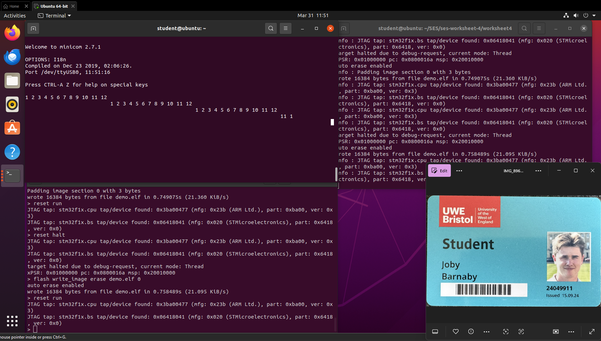
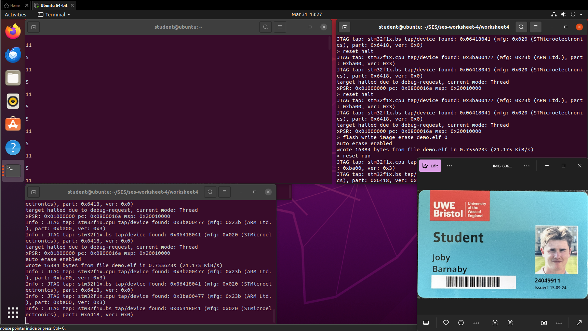
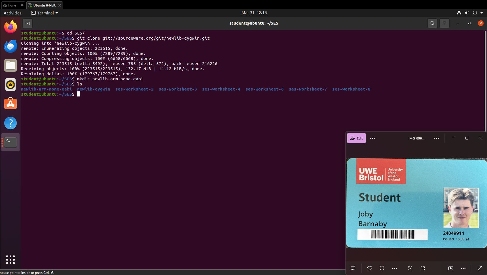
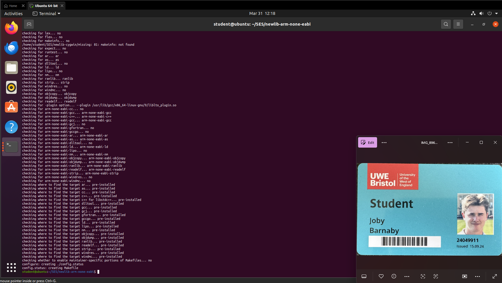
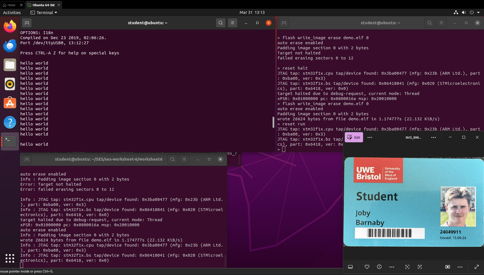

# ARM Cortex M3 | STM32P107 | Embedded Systems  
  
## Worksheet 6 — Timer Interrupts and Real-Time Processing
  
**Student Name:** Joby Barnaby 
**Student ID:** 24049911

---
## Overview

This worksheet covers downloading, configuring, cross-compiling, and integrating **newlib** into a bare-metal embedded project so that standard C functions like `printf`, `scanf`, and `malloc` work on hardware with no operating system.

---

## Warm-Up Exercise A — Print Numbers 1–12 as ASCII

### Description

Write a loop inside `main()` that prints the numbers 1 to 12 as readable digit characters using only `putchar()` / `__io_putchar()`. This exercise shows why a library is needed — even printing a number is awkward without one.

**File to edit:** `main.c` in your worksheet 4 project  
**Where to put the code:** Inside the `while(1)` loop in `main()`

### Code

```c
/* Goes inside while(1) in main() */
for (int i = 1; i <= 12; i++) {
    if (i >= 10) {
        __io_putchar('0' + (i / 10));  /* tens digit */
    }
    __io_putchar('0' + (i % 10));      /* units digit */
    __io_putchar(' ');
}
__io_putchar('\n');
```

### Explanation

`putchar(i)` sends the raw byte value — not the digit character. To print `'1'` you need ASCII code 49, which is `'0' + 1`. For two-digit numbers (10–12) the tens and units digits are extracted separately using integer division and modulo.

### Result

The numbers 1 through 12 appear in the serial terminal as readable characters.



---

## Warm-Up Exercise B — Implement strlen()

### Description

Write your own `strlen()` function and call it from `main()` to test it.

**File to edit:** `main.c` in your worksheet 4 project  
**Where to put the function:** ABOVE `main()`, not inside it  
**Where to put the test code:** Inside the `while(1)` loop in `main()`

### Code

**Add this ABOVE main():**

c

```c
int my_strlen(const char *s) {
    int count = 0;
    while (s[count] != '\0') {
        count++;
    }
    return count;
}
```

**Add this INSIDE the while(1) loop in main() to test it:**

c

```c
int n;

n = my_strlen("Hello");         /* should return 5 */
__io_putchar('0' + n);
__io_putchar('\n');

n = my_strlen("Hello World");   /* should return 11 */
__io_putchar('0' + (n / 10));
__io_putchar('0' + (n % 10));
__io_putchar('\n');
```

### Explanation

The function walks the string one character at a time, incrementing a counter until it hits the null terminator `'\0'`. The test code prints the result using the same ASCII trick from Exercise A since we still have no `printf`.

### Result

The serial terminal prints `5` then `11`.



---

## Step 1 — Clone the newlib Source Code

**Where:** In a terminal, navigate to your labs folder (e.g. `~/SES`) — NOT inside your project folder.

bash

```bash
cd ~/SES
git clone git://sourceware.org/git/newlib-cygwin.git
```

This creates `newlib-cygwin/` containing all the source.

---

## Step 2 — Create the Build Directory

**Where:** Run this in the SAME folder as `newlib-cygwin/` (e.g. `~/SES`):

bash

```bash
mkdir newlib-arm-none-eabi
```

Your folder structure should now be:

```
~/SES/
  newlib-cygwin/          ← source (never edit or build inside here)
  newlib-arm-none-eabi/   ← your build directory (currently empty)
  ses-worksheet-4/        ← your existing project
```




---

## Step 3 — Configure newlib

**Where:** Change into the build directory first, then run configure from there.

bash

```bash
cd newlib-arm-none-eabi

../newlib-cygwin/configure \
  --target arm-none-eabi \
  --disable-newlib-supplied-syscalls \
  --srcdir=../newlib-cygwin \
  --prefix=`pwd` \
  --with-gnu-as \
  --with-gnu-ld \
  --enable-multilib=no
```

### What each flag means

|Flag|Meaning|
|---|---|
|`--target arm-none-eabi`|Cross-compile ON a PC FOR an ARM Cortex-M3 with no OS|
|`--disable-newlib-supplied-syscalls`|Don't use newlib's built-in OS calls — we supply our own|
|`--srcdir=../newlib-cygwin`|Where the source code lives|
|`--prefix=\`pwd``|Install output into the current build directory|
|`--with-gnu-as --with-gnu-ld`|Use the ARM GNU assembler and linker|
|`--enable-multilib=no`|Build for one target only|

**Success looks like** (last lines of output):

```
config.status: creating Makefile
```



---

## Step 4 — Build newlib

**Where:** Still inside `newlib-arm-none-eabi/`. Run `script` first to log output, then make:

bash

```bash
script
```

Then run this as ONE command (the `\` at the end of each line joins them):

bash

```bash
make CFLAGS_FOR_TARGET="-ffunction-sections -fdata-sections -DPREFER_SIZE_OVER_SPEED \
-D__OPTIMIZE_SIZE__ -Os -fomit-frame-pointer -march=armv7-m -mcpu=cortex-m3 \
-mthumb -mthumb-interwork -D__thumb2__ -D__BUFSIZ__=256" \
CCASFLAGS="-march=armv7-m -mcpu=cortex-m3 -mthumb -mthumb-interwork -D__thumb2__"
```

When done, stop logging:

bash

```bash
exit
```

**Success:** A new `arm-none-eabi/` directory appears inside `newlib-arm-none-eabi/` containing `newlib/` and `libgloss/`.

---

## Step 5 — Copy syscalls.c Into Your Project

**What:** Copy `syscalls.c` from the Lab4.1 repo.  
**Where to put it:** In your worksheet 4 project folder, alongside `main.c` and `Makefile`.

Then open `syscalls.c` and find the `_read` function. It currently looks like this:

c

```c
int _read(int file, char *ptr, int len) {
    errno = EBADF;
    return -1;
}
```

**Replace the entire body** with this working version:

c

```c
int _read(int file, char *ptr, int len) {
    int n;
    switch (file) {
        case STDIN_FILENO:
            for (n = 0; n < len; n++) {
                ptr[n] = __io_getchar();
                if (ptr[n] == '\r' || ptr[n] == '\n') {
                    n++;
                    break;
                }
            }
            return n;
        default:
            errno = EBADF;
            return -1;
    }
}
```

Save `syscalls.c`.

---

## Step 6 — Update the Makefile

**File to edit:** `Makefile` in your worksheet 4 project folder.  
Make the following 5 changes:

**Change 1 — Add these two lines** near the top where library paths are defined:

makefile

```makefile
NEWLIB=../../newlib-arm-none-eabi/arm-none-eabi/newlib
NEWLIBINCLUDE=../../newlib-cygwin/newlib/libc/include/
```

**Change 2 — Find the STARTUP line and add `sys_calls.o` at the end:**

makefile

```makefile
# Before:
STARTUP= startup_stm32f10x.o system_stm32f10x.o core_cm3.o

# After:
STARTUP= startup_stm32f10x.o system_stm32f10x.o core_cm3.o sys_calls.o
```

**Change 3 — Add the newlib include path to CFLAGS:**

makefile

```makefile
CFLAGS+= -I$(NEWLIBINCLUDE)
```

**Change 4 — Add to LDFLAGS:**

makefile

```makefile
LDFLAGS+= -T$(LDSCRIPT) -nostdlib -static -L$(NEWLIB) -lgcc -mthumb -mcpu=cortex-m3
```

**Change 5 — Update the final link line** (find the `$(ELF)` rule):

makefile

```makefile
# Before:
$(ELF) : $(OBJS)
    $(LD) $(LDFLAGS) -o $@ $(OBJS)

# After:
$(ELF) : $(OBJS)
    $(LD) $(LDFLAGS) -o $@ -lc -lm $(OBJS) -lc -lm -lgcc
```

Save the Makefile.

---

## Pass Exercise — Test printf

### Description

Create a `main.c` that uses `printf` — the first real test that newlib is correctly linked.

**File to edit:** `main.c` in your project folder  
**What to do:** Replace the entire contents of `main.c` with the code below, filling in your real `__io_putchar()` code from worksheet 4

### Code

**Complete main.c — replace everything with this:**

c

```c
int main(void) {
    COMPortInit();
    while (1) {
        printf("hello world\r\n");
        fflush(stdout);
        /* simple delay */
        for (volatile int i = 0; i < 100000; i++) {}
    }
}
```

### Explanation

When `printf("hello world\n")` is called, newlib formats the string then calls `_write()` from `syscalls.c`. `_write()` calls `__io_putchar()` for each character, which sends it over the UART. This tests the full chain: `printf` → newlib → `_write` → `__io_putchar` → UART.

### Result

"hello world" prints repeatedly in the serial terminal.


---

## Pass Exercise — Implement _read

### Description

Add `__io_getchar()` to `main.c` and test that `scanf` can receive input from the terminal.

**File to edit:** `main.c`  
**Where:** Add `__io_getchar()` directly below `__io_putchar()`. Then update `main()`.

### Code

**Add this function below `__io_putchar()` in main.c:**

c

```c
/* PASTE your __io_getchar() from worksheet 4 here */
/* It is called by _read() in syscalls.c every time scanf needs a character */
int __io_getchar(void) {
    /* your real UART receive code goes here */
    return 0;
}
```

**Replace main() with:**

c

```c
int main(void) {
    char input[64];
    COMPortInit();

    while (1) {
        printf("Type something and press Enter: ");
        scanf("%63s", input);
        printf("You typed: %s\n", input);
    }
}
```

### Explanation

`_read()` in `syscalls.c` (which you updated in Step 5) now calls `__io_getchar()` for each character. `scanf` calls `_read` internally, so this tests the full input chain: `scanf` → `_read` → `__io_getchar` → UART.

### Result

Not Completed due to an unkown error in the pass excersise i was unable to get this working. the code built but when running the commands to view the results in the terminal like the previous tasks. the minicom was unable to receive the information inputted.


---

## Credit Exercise — Maths Test Program

### Description

Write a maths quiz that generates random questions, reads user answers with `scanf`, and keeps score.

**File to edit:** `main.c`  
**Where:** Replace `main()` — keep your `__io_putchar()` and `__io_getchar()` at the top of the file. Add `#include <stdlib.h>` with your other includes.

### Code

**Add to the top of main.c (with the other includes):**

c

```c
#include <stdlib.h>   /* for rand() and srand() */
```

**Replace main() with:**

c

```c
int main(void) {
    int a, b, correct_answer, user_answer;
    int score = 0;
    int total = 5;

    COMPortInit();
    srand(12345);   /* fixed seed — no clock available on bare metal */

    printf("=== Maths Test ===\n");

    for (int i = 0; i < total; i++) {
        a = (rand() % 10) + 1;
        b = (rand() % 10) + 1;
        correct_answer = a + b;

        printf("Q%d: %d + %d = ? ", i + 1, a, b);
        scanf("%d", &user_answer);

        if (user_answer == correct_answer) {
            printf("Correct!\n");
            score++;
        } else {
            printf("Wrong! Answer was %d\n", correct_answer);
        }
    }

    printf("\nFinal score: %d / %d\n", score, total);
    while(1);
}
```

### Explanation

`srand()` seeds the random number generator with a fixed value — on bare metal there is no real-time clock so a fixed seed is used. `rand()` generates pseudo-random numbers. `printf` with `%d` format specifiers displays the question, and `scanf("%d", &user_answer)` reads the typed integer. This tests both `printf` and `scanf` together, and also exercises `_sbrk` (heap management) which newlib's formatted I/O uses internally.

### Result

What was supposed to happen: Five arithmetic questions appear in the serial terminal. The user types each answer and receives a correct/wrong response. A final score is printed. 

What did happen: As the same as before with the pass task, the files compiled and flashed correctly but when running the mincom terminal to see the results nothing showed up just a blank mincom screen. 

---

## Credit Exercise — Debug Memory Output

### Description

Print the memory addresses of the heap start, stack pointer, and a `malloc`'d block so you can see what `_sbrk` is managing.

**File to edit:** `main.c`  
**Where:** Add `extern char _ebss;` at the very top of the file before all `#include` lines. Then replace `main()`.

### Code

**Add this at the very top of main.c — BEFORE the #include lines:**

c

```c
extern char _ebss;   /* defined by linker script — marks end of BSS / start of heap */
```

**Your includes should look like this after:**

c

```c
extern char _ebss;

#include <stm32f10x.h>
#include <stdio.h>
#include <stdlib.h>
```

**Replace main() with:**

c

```c
int main(void) {
    COMPortInit();

    char *heap_start = &_ebss;
    char *stack_now  = (char*) __get_MSP();

    printf("=== Memory Layout ===\n");
    printf("Heap starts at : 0x%08X\n", (unsigned int)heap_start);
    printf("Stack is at    : 0x%08X\n", (unsigned int)stack_now);
    printf("Free RAM gap   : %d bytes\n", (int)(stack_now - heap_start));

    char *block = malloc(256);

    printf("\nAfter malloc(256):\n");
    printf("Block at       : 0x%08X\n", (unsigned int)block);
    printf("Stack now      : 0x%08X\n", (unsigned int)(char*)__get_MSP());

    while(1);
}
```

### Explanation

`_ebss` is a symbol the linker script defines — it marks the end of the BSS segment, which is where the heap begins. `__get_MSP()` reads the Main Stack Pointer register. Printing both shows the available RAM between them. After `malloc(256)`, the returned address should be just above `_ebss`, confirming `_sbrk` advanced the heap pointer correctly. The stack pointer should be unchanged — the heap grows upward while the stack grows downward.

### Result

What was supposed to happen: The serial terminal shows four memory addresses. The allocated block address is just above the heap start. The stack pointer is unchanged before and after `malloc`.

What did happen: The same as the two previous tasks my minicom terminal remained blank the same as the task before and didnt even print the `printf` statements that were written in the main.c compiled and flashed to the olimex board. 

---

## Key Concepts

### Why enable the RCC clock first?

The STM32 saves power by keeping peripheral clocks gated off by default. `RCC_APB2PeriphClockCmd()` must be called before any GPIO register can be written, otherwise the peripheral is unresponsive.

### Library comparison

|Library|Why it doesn't work for us|
|---|---|
|`glibc`|Too large for the Olimex board's flash|
|`uclibc`|Requires Linux running on the target (~4MB RAM needed)|
|`newlib`|Designed for small bare-metal systems with no OS ✓|

### What are syscall stubs?

newlib calls OS-level functions (`_write`, `_read`, `_sbrk` etc.) internally. Since there is no OS, `syscalls.c` provides stub versions that either do the minimum needed (`_write` → UART, `_sbrk` → heap) or return a graceful error for things we cannot support (file system, processes).

### What is the heap?

The heap is the unused RAM between the end of your program's data (`_ebss`) and the bottom of the stack. `malloc` calls `_sbrk` to take chunks of this space. `_sbrk` checks that heap and stack never collide.

### Why does `-lc -lm` appear twice in the linker line?

The linker reads libraries left to right. Listing them twice (before and after the object files) ensures circular dependencies between `libc`, `libm`, and `libgcc` are all resolved.

---

## Final Conclusion

This worksheet demonstrated cross-compiling a C standard library from source and integrating it into a bare-metal embedded project. By providing `_write` and `_sbrk` stubs in `syscalls.c`, standard functions like `printf`, `scanf`, and `malloc` were made to work on hardware with no operating system. The task in this task became rather difficult to complete in the end and after a while of working on them i decided it would be better to move on and attempt the other worksheets as i didnt seem to be getting anywhere with it, im not sure whether there was an error with the board or the code that i was flashing to the board.
