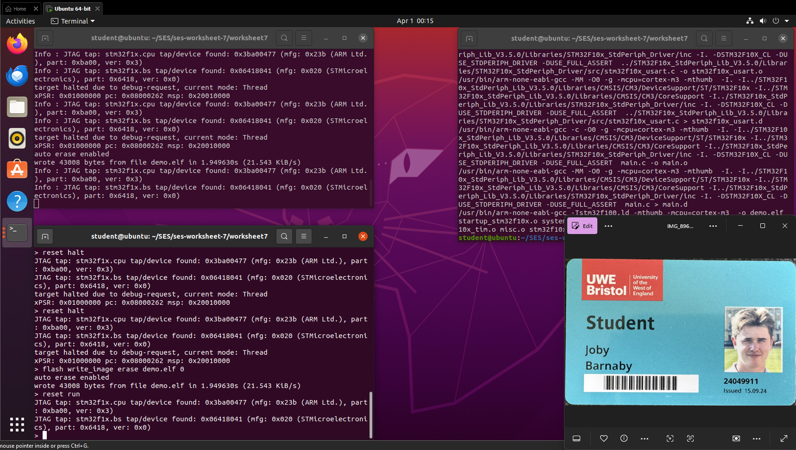
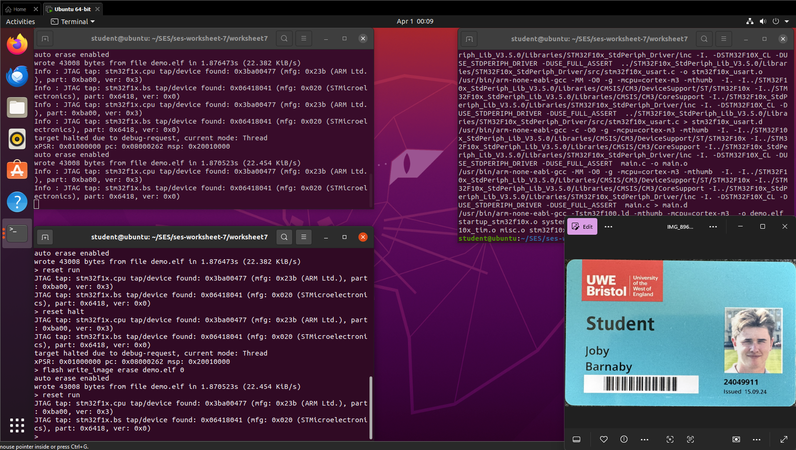
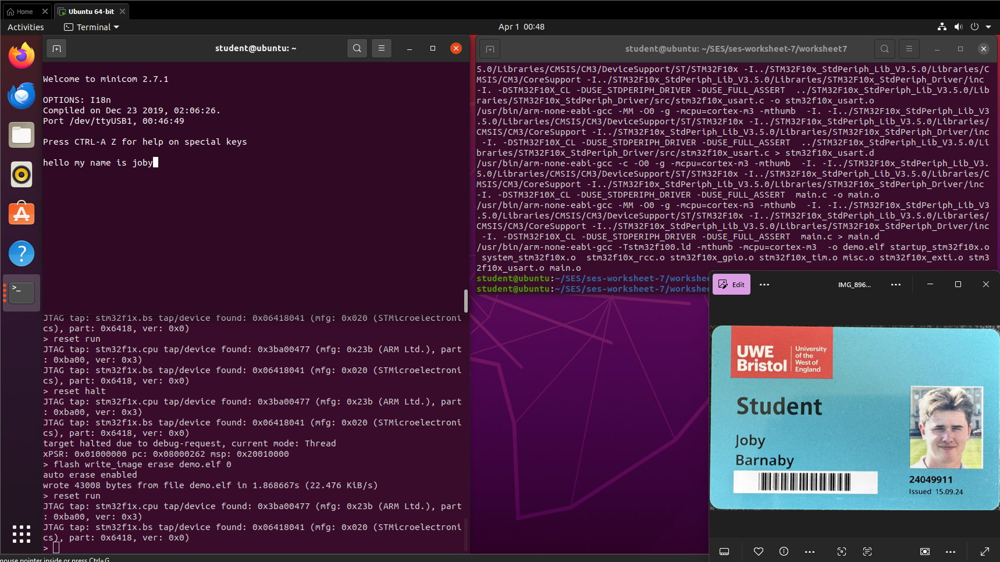
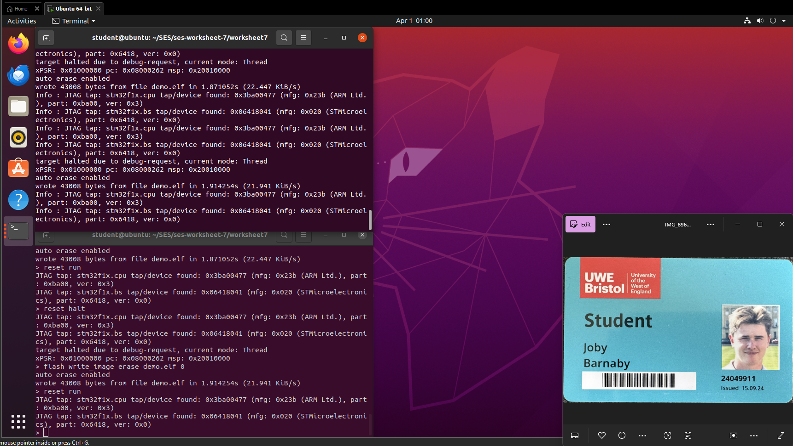

# ARM Cortex M3 | STM32P107 | Embedded Systems  
  
## Worksheet 7 — Communication Interfaces (UART)
  
**Student Name:** Joby Barnaby 
**Student ID:** 24049911


---
## Overview

This worksheet covers interrupt-driven programming on the STM32F100 Cortex-M3 microcontroller. It progresses through timer interrupts, external GPIO interrupts, interrupt-driven UART communication, and Pulse Width Modulation (PWM) using hardware timers.

---

## Hardware Used

|Component|Pin|Description|
|---|---|---|
|Green LED|PC6|Port C, Pin 6|
|Yellow LED|PC7|Port C, Pin 7|
|WKUP Button|PA0|Port A, Pin 0|

---

## Repository Setup

```
cd ~/SES
git clone https://gitlab.uwe.ac.uk/c-duffy/ses-worksheet-7.git
cd ses-worksheet-7/worksheet7
```

### File Structure

```
ses-worksheet-7/
  STM32F10x_StdPeriph_Lib_V3.5.0/
    Libraries/STM32F10x_StdPeriph_Driver/
      src/
        stm32f10x_rcc.c
        stm32f10x_gpio.c
        stm32f10x_tim.c
        stm32f10x_exti.c
        stm32f10x_usart.c
        misc.c
      inc/
        stm32f10x_rcc.h
        stm32f10x_gpio.h
        stm32f10x_tim.h
        stm32f10x_exti.h
        stm32f10x_usart.h
        misc.h
  worksheet7/
    main.c                <- Your code
    Makefile              <- Modified to include all required libraries
    openocd.cfg
    startup_stm32f10x.c
    stm32f100.ld
    stm32f10x_conf.h
```

### Makefile Changes

Two changes were made to the Makefile before starting:

**1. Add USART library object:**

```makefile
# Before
OBJS= $(STARTUP) stm32f10x_rcc.o stm32f10x_gpio.o stm32f10x_tim.o misc.o stm32f10x_exti.o main.o

# After
OBJS= $(STARTUP) stm32f10x_rcc.o stm32f10x_gpio.o stm32f10x_tim.o misc.o stm32f10x_exti.o stm32f10x_usart.o main.o
```

**2. Disable compiler optimisation (for reliable debugging):**

```makefile
# Before
CFLAGS = -O1 -g

# After
CFLAGS = -O0 -g
```

---

## Build & Flash Workflow

Every exercise follows the same build and flash process.

**Build commands:**

```bash
make clean
make
```

**Terminal 1 — Start OpenOCD:**

```bash
openocd -f openocd.cfg
```

**Terminal 2 — Flash the board:**

```bash
telnet localhost 4444
reset halt
flash write_image erase demo.elf 0
reset run
```

---

## Exercise 1 — Timer Interrupt (LED Flashing)

### Description:

This exercise demonstrates interrupt-driven output using a hardware timer. Timer 2 (TIM2) is configured to fire a periodic interrupt that toggles the green LEDs on PC6 and PC7.

### Code:

```c
#include <stm32f10x.h>
#include <stm32f10x_rcc.h>
#include <stm32f10x_gpio.h>
#include <stm32f10x_tim.h>
#include "misc.h"

GPIO_InitTypeDef GPIO_InitStructure;
static int greenledval = 0;

void configure_timer(void)
{
    RCC_APB1PeriphClockCmd(RCC_APB1Periph_TIM2, ENABLE);
    TIM_TimeBaseInitTypeDef timerInitStructure;
    timerInitStructure.TIM_Prescaler = 36000 - 1;
    timerInitStructure.TIM_CounterMode = TIM_CounterMode_Up;
    timerInitStructure.TIM_Period = 1000 - 1;
    timerInitStructure.TIM_ClockDivision = TIM_CKD_DIV1;
    timerInitStructure.TIM_RepetitionCounter = 0;
    TIM_TimeBaseInit(TIM2, &timerInitStructure);
    TIM_Cmd(TIM2, ENABLE);
    TIM_ITConfig(TIM2, TIM_IT_Update, ENABLE);
}

void configure_timer2_interrupt(void)
{
    NVIC_InitTypeDef nvicStructure;
    nvicStructure.NVIC_IRQChannel = TIM2_IRQn;
    nvicStructure.NVIC_IRQChannelPreemptionPriority = 0;
    nvicStructure.NVIC_IRQChannelSubPriority = 1;
    nvicStructure.NVIC_IRQChannelCmd = ENABLE;
    NVIC_Init(&nvicStructure);
}

void TIM2_IRQHandler(void)
{
    if (TIM_GetITStatus(TIM2, TIM_IT_Update) != RESET)
    {
        TIM_ClearITPendingBit(TIM2, TIM_IT_Update);
        GPIO_WriteBit(GPIOC, GPIO_Pin_6, (greenledval) ? Bit_SET : Bit_RESET);
        GPIO_WriteBit(GPIOC, GPIO_Pin_7, (greenledval) ? Bit_SET : Bit_RESET);
        greenledval = 1 - greenledval;
    }
}

int main(void)
{
    RCC_APB2PeriphClockCmd(RCC_APB2Periph_GPIOC, ENABLE);
    GPIO_InitStructure.GPIO_Pin = GPIO_Pin_6 | GPIO_Pin_7;
    GPIO_InitStructure.GPIO_Speed = GPIO_Speed_50MHz;
    GPIO_InitStructure.GPIO_Mode = GPIO_Mode_Out_PP;
    GPIO_Init(GPIOC, &GPIO_InitStructure);
    configure_timer();
    configure_timer2_interrupt();
    while (1) {}
}

#ifdef USE_FULL_ASSERT
void assert_failed(uint8_t* file, uint32_t line) { while (1) {} }
#endif
```

### Explanation:

TIM2 is clocked from the 36 MHz APB1 bus. With a prescaler of 35999 and a period of 999, the timer fires an interrupt once per second. The ISR name `TIM2_IRQHandler` is fixed by the STM32 vector table; the weak linker attribute in `startup_stm32f10x.c` allows this definition to override the default empty handler. The ISR clears the pending bit before acting — without this the interrupt fires continuously.

### Result:

The green LEDs on PC6 and PC7 flash at 1 Hz, demonstrating timer-driven interrupt output with no polling in the main loop.




---

## Exercise 2 — Button External Interrupt

### Description:

This exercise connects the WKUP button (PA0) to an external interrupt line (EXTI0). Each press toggles the yellow LED. A second interrupt on PC13 (TAMPER button) toggles the green LED.

### Code:

```c
#include <stm32f10x.h>
#include <stm32f10x_rcc.h>
#include <stm32f10x_gpio.h>
#include <stm32f10x_exti.h>
#include "misc.h"

GPIO_InitTypeDef GPIO_InitStructure;
EXTI_InitTypeDef EXTI_InitStructure;
NVIC_InitTypeDef NVIC_InitStructure;

static int yellowledval = 0;
static int greenledval  = 0;

void init_buttons_and_leds(void)
{
    RCC_APB2PeriphClockCmd(RCC_APB2Periph_GPIOA |
                           RCC_APB2Periph_GPIOC |
                           RCC_APB2Periph_AFIO,  ENABLE);

    /* LEDs — PC6 (green), PC7 (yellow) as outputs */
    GPIO_InitStructure.GPIO_Pin   = GPIO_Pin_6 | GPIO_Pin_7;
    GPIO_InitStructure.GPIO_Speed = GPIO_Speed_50MHz;
    GPIO_InitStructure.GPIO_Mode  = GPIO_Mode_Out_PP;
    GPIO_Init(GPIOC, &GPIO_InitStructure);

    /* WKUP button — PA0 floating input */
    GPIO_InitStructure.GPIO_Pin  = GPIO_Pin_0;
    GPIO_InitStructure.GPIO_Mode = GPIO_Mode_IN_FLOATING;
    GPIO_Init(GPIOA, &GPIO_InitStructure);
    GPIO_EXTILineConfig(GPIO_PortSourceGPIOA, GPIO_PinSource0);

    EXTI_InitStructure.EXTI_Line    = EXTI_Line0;
    EXTI_InitStructure.EXTI_Mode    = EXTI_Mode_Interrupt;
    EXTI_InitStructure.EXTI_Trigger = EXTI_Trigger_Rising;
    EXTI_InitStructure.EXTI_LineCmd = ENABLE;
    EXTI_Init(&EXTI_InitStructure);

    NVIC_InitStructure.NVIC_IRQChannel                   = EXTI0_IRQn;
    NVIC_InitStructure.NVIC_IRQChannelPreemptionPriority = 0;
    NVIC_InitStructure.NVIC_IRQChannelSubPriority        = 1;
    NVIC_InitStructure.NVIC_IRQChannelCmd                = ENABLE;
    NVIC_Init(&NVIC_InitStructure);

    /* TAMPER button — PC13 floating input */
    GPIO_InitStructure.GPIO_Pin  = GPIO_Pin_13;
    GPIO_InitStructure.GPIO_Mode = GPIO_Mode_IN_FLOATING;
    GPIO_Init(GPIOC, &GPIO_InitStructure);
    GPIO_EXTILineConfig(GPIO_PortSourceGPIOC, GPIO_PinSource13);

    EXTI_InitStructure.EXTI_Line    = EXTI_Line13;
    EXTI_InitStructure.EXTI_Trigger = EXTI_Trigger_Falling;
    EXTI_Init(&EXTI_InitStructure);

    NVIC_InitStructure.NVIC_IRQChannel = EXTI15_10_IRQn;
    NVIC_Init(&NVIC_InitStructure);
}

void EXTI0_IRQHandler(void)
{
    if (EXTI_GetITStatus(EXTI_Line0) == SET)
    {
        EXTI_ClearITPendingBit(EXTI_Line0);
        GPIO_WriteBit(GPIOC, GPIO_Pin_7, (yellowledval) ? Bit_SET : Bit_RESET);
        yellowledval = 1 - yellowledval;
    }
}

void EXTI15_10_IRQHandler(void)
{
    if (EXTI_GetITStatus(EXTI_Line13) == SET)
    {
        EXTI_ClearITPendingBit(EXTI_Line13);
        GPIO_WriteBit(GPIOC, GPIO_Pin_6, (greenledval) ? Bit_SET : Bit_RESET);
        greenledval = 1 - greenledval;
    }
}

int main(void)
{
    init_buttons_and_leds();
    while (1) {}
}

#ifdef USE_FULL_ASSERT
void assert_failed(uint8_t* file, uint32_t line) { while (1) {} }
#endif
```

### Explanation:

The WKUP button (PA0) is connected to EXTI Line 0 via `GPIO_EXTILineConfig()`. AFIO must be clocked before this call. The TAMPER button (PC13) shares `EXTI15_10_IRQn` with lines 10–15, so the ISR checks `EXTI_GetITStatus(EXTI_Line13)` before acting. Both ISRs clear their pending bits immediately to prevent continuous re-triggering.

### Result:

Pressing WKUP toggles the yellow LED. Pressing TAMPER toggles the green LED. Both are fully interrupt-driven with no polling in the main loop.




---

## Exercise 3 — Interrupt-Driven UART

### Description:

This exercise replaces polled UART with interrupt-driven receive. Received characters are echoed back to the sender.

### Code:

```c
#include <stm32f10x.h>
#include <stm32f10x_rcc.h>
#include <stm32f10x_gpio.h>
#include <stm32f10x_usart.h>
#include "misc.h"

USART_InitTypeDef USART_InitStructure;
GPIO_InitTypeDef  GPIO_InitStructure;
NVIC_InitTypeDef  NVIC_InitStructure;

volatile int gotit  = 0;
volatile int rxdata = 0;

void COMPortInit(void)
{
    RCC_APB2PeriphClockCmd(RCC_APB2Periph_GPIOD | RCC_APB2Periph_AFIO, ENABLE);
    RCC_APB1PeriphClockCmd(RCC_APB1Periph_USART2, ENABLE);
    GPIO_PinRemapConfig(GPIO_Remap_USART2, ENABLE);

    /* TX — PD5 alternate function push-pull */
    GPIO_InitStructure.GPIO_Pin   = GPIO_Pin_5;
    GPIO_InitStructure.GPIO_Speed = GPIO_Speed_50MHz;
    GPIO_InitStructure.GPIO_Mode  = GPIO_Mode_AF_PP;
    GPIO_Init(GPIOD, &GPIO_InitStructure);

    /* RX — PD6 floating input */
    GPIO_InitStructure.GPIO_Pin  = GPIO_Pin_6;
    GPIO_InitStructure.GPIO_Mode = GPIO_Mode_IN_FLOATING;
    GPIO_Init(GPIOD, &GPIO_InitStructure);

    USART_Cmd(USART2, ENABLE);

    USART_InitStructure.USART_BaudRate            = 115200;
    USART_InitStructure.USART_WordLength          = USART_WordLength_8b;
    USART_InitStructure.USART_StopBits            = USART_StopBits_1;
    USART_InitStructure.USART_Parity              = USART_Parity_No;
    USART_InitStructure.USART_HardwareFlowControl = USART_HardwareFlowControl_None;
    USART_InitStructure.USART_Mode                = USART_Mode_Tx | USART_Mode_Rx;
    USART_Init(USART2, &USART_InitStructure);

    USART_ITConfig(USART2, USART_IT_RXNE, ENABLE);

    NVIC_InitStructure.NVIC_IRQChannel                   = USART2_IRQn;
    NVIC_InitStructure.NVIC_IRQChannelPreemptionPriority = 0;
    NVIC_InitStructure.NVIC_IRQChannelSubPriority        = 1;
    NVIC_InitStructure.NVIC_IRQChannelCmd                = ENABLE;
    NVIC_Init(&NVIC_InitStructure);
    NVIC_EnableIRQ(USART2_IRQn);
}

void USART2_IRQHandler(void)
{
    if (USART_GetITStatus(USART2, USART_IT_RXNE) != RESET)
    {
        rxdata = (int)USART_ReceiveData(USART2) & 0xFF;
        gotit  = 1;
        USART_ClearITPendingBit(USART2, USART_IT_RXNE);
    }
}

void outbyte(int c)
{
    while (USART_GetFlagStatus(USART2, USART_FLAG_TXE) == RESET);
    USART_SendData(USART2, (uint16_t)c);
}

int main(void)
{
    COMPortInit();
    while (1)
    {
        if (gotit == 1)
        {
            outbyte(rxdata);
            gotit = 0;
        }
    }
}

#ifdef USE_FULL_ASSERT
void assert_failed(uint8_t* file, uint32_t line) { while (1) {} }
#endif
```

### Explanation:

USART2 is remapped to PD5 (TX) and PD6 (RX). Only the receive interrupt (RXNE) is enabled. When a byte arrives the ISR stores it in `rxdata` and sets the `gotit` flag. The main loop polls this software flag and echoes the character back. Both variables are marked `volatile` to prevent the compiler optimising away reads in the main loop.

### Result:

Characters typed in a serial terminal (115200 baud, 8N1) are echoed back, demonstrating interrupt-driven receive with no polling of the hardware status register in the main loop.



---

## Credit Exercise — Interrupt-Driven UART with Ring Buffer

### Description:

This exercise extends Exercise 3 to full interrupt-driven TX and RX using 20-byte ring buffers, decoupling the application from the hardware timing of the UART.

### Code:

```c
#include <stm32f10x.h>
#include <stm32f10x_usart.h>
#include "misc.h"

#define BUF_SIZE 20

volatile char tx_buf[BUF_SIZE];
volatile char rx_buf[BUF_SIZE];
volatile int  tx_head = 0, tx_tail = 0;
volatile int  rx_head = 0, rx_tail = 0;

void putchar_irq(char c)
{
    int next = (tx_head + 1) % BUF_SIZE;
    if (next == tx_tail) return;  /* buffer full — drop */
    tx_buf[tx_head] = c;
    tx_head = next;
    USART_ITConfig(USART2, USART_IT_TXE, ENABLE);
}

int getchar_irq(void)
{
    if (rx_head == rx_tail) return -1;
    char c = rx_buf[rx_tail];
    rx_tail = (rx_tail + 1) % BUF_SIZE;
    return (int)c;
}

void USART2_IRQHandler(void)
{
    if (USART_GetITStatus(USART2, USART_IT_RXNE) != RESET)
    {
        char c = (char)(USART_ReceiveData(USART2) & 0xFF);
        int next = (rx_head + 1) % BUF_SIZE;
        if (next != rx_tail)
        {
            rx_buf[rx_head] = c;
            rx_head = next;
        }
        USART_ClearITPendingBit(USART2, USART_IT_RXNE);
    }
    if (USART_GetITStatus(USART2, USART_IT_TXE) != RESET)
    {
        if (tx_tail != tx_head)
        {
            USART_SendData(USART2, tx_buf[tx_tail]);
            tx_tail = (tx_tail + 1) % BUF_SIZE;
        }
        else
        {
            /* Nothing left — disable TXE to stop continuous firing */
            USART_ITConfig(USART2, USART_IT_TXE, DISABLE);
        }
    }
}

int main(void)
{
    COMPortInit();
    while (1)
    {
        int c = getchar_irq();
        if (c != -1) putchar_irq((char)c);
    }
}

#ifdef USE_FULL_ASSERT
void assert_failed(uint8_t* file, uint32_t line) { while (1) {} }
#endif
```

### Explanation:

Separate ring buffers are used for TX and RX. `putchar_irq()` writes to the TX buffer and enables the TXE interrupt. The ISR sends one byte per interrupt and disables TXE when the buffer empties — without this the ISR fires continuously even with nothing to send. The RX ISR writes incoming bytes into the RX buffer, dropping silently if full.

### Result:

Full interrupt-driven echo with buffered TX and RX. The main loop never stalls waiting on hardware, demonstrating the producer/consumer pattern for UART IO.


---

## Credit Exercise — Pulse Width Modulation (PWM)

### Description:

This exercise uses Timer 3 in PWM mode to smoothly fade the green LED (PC6) in and out. The credit extension fades the yellow LED (PC7) in the opposite direction simultaneously.

### Code:

```c
#include <stm32f10x.h>
#include <stm32f10x_rcc.h>
#include <stm32f10x_gpio.h>
#include <stm32f10x_tim.h>

GPIO_InitTypeDef        GPIO_InitStructure;
TIM_TimeBaseInitTypeDef TIM_TimeBaseInitStruct;
TIM_OCInitTypeDef       TIM_OCInitStruct;

void configure_timer(void)
{
    RCC_APB1PeriphClockCmd(RCC_APB1Periph_TIM3, ENABLE);
    RCC_APB2PeriphClockCmd(RCC_APB2Periph_GPIOC | RCC_APB2Periph_AFIO, ENABLE);

    GPIO_InitStructure.GPIO_Pin   = GPIO_Pin_6 | GPIO_Pin_7;
    GPIO_InitStructure.GPIO_Speed = GPIO_Speed_50MHz;
    GPIO_InitStructure.GPIO_Mode  = GPIO_Mode_AF_PP;
    GPIO_Init(GPIOC, &GPIO_InitStructure);
    GPIO_PinRemapConfig(GPIO_FullRemap_TIM3, ENABLE);

    TIM_TimeBaseStructInit(&TIM_TimeBaseInitStruct);
    TIM_TimeBaseInitStruct.TIM_ClockDivision = TIM_CKD_DIV4;
    TIM_TimeBaseInitStruct.TIM_Period        = 1000 - 1;
    TIM_TimeBaseInitStruct.TIM_Prescaler     = 240  - 1;
    TIM_TimeBaseInit(TIM3, &TIM_TimeBaseInitStruct);

    TIM_OCStructInit(&TIM_OCInitStruct);
    TIM_OCInitStruct.TIM_OutputState = TIM_OutputState_Enable;
    TIM_OCInitStruct.TIM_OCMode      = TIM_OCMode_PWM1;
    TIM_OCInitStruct.TIM_Pulse       = 0;
    TIM_OC1Init(TIM3, &TIM_OCInitStruct);  /* CH1 -> PC6 green  */
    TIM_OC2Init(TIM3, &TIM_OCInitStruct);  /* CH2 -> PC7 yellow */

    TIM_Cmd(TIM3, ENABLE);
}

int main(void)
{
    int i;
    int n = 1;
    int brightness = 0;
    configure_timer();
    while (1)
    {
        if (brightness >= 1000) n = -1;
        if (brightness <= 0)    n =  1;
        brightness += n;
        TIM3->CCR1 = brightness;         /* green  — fades in  */
        TIM3->CCR2 = 1000 - brightness;  /* yellow — fades out */
        for (i = 0; i < 0x4000; i++);
    }
}

#ifdef USE_FULL_ASSERT
void assert_failed(uint8_t* file, uint32_t line) { while (1) {} }
#endif
```

### Explanation:

TIM3 is configured in PWM mode with a period of 999 and prescaler of 239, producing a 75 Hz PWM signal. PC6 and PC7 are configured as `GPIO_Mode_AF_PP` and remapped to TIM3 channels 1 and 2 using `GPIO_FullRemap_TIM3`. Writing `CCR2 = 1000 - brightness` ensures the yellow LED fades in the opposite direction to the green.

### Result:

The green LED smoothly fades in and out. With the credit extension, the yellow LED simultaneously fades in the opposite direction, demonstrating hardware PWM with no CPU overhead.




---

## Key Concepts

### Why clear the pending bit in every ISR?

If the pending bit is not cleared before returning from the ISR, the interrupt controller immediately re-triggers the same ISR, locking the processor in a continuous interrupt loop. Clearing it first is mandatory in every ISR on the Cortex-M3 NVIC.

### NVIC Interrupt Table Used

|IRQ Channel|Vector Name|Exercise|Purpose|
|---|---|---|---|
|TIM2_IRQn|TIM2_IRQHandler|1|Timer 2 update|
|EXTI0_IRQn|EXTI0_IRQHandler|2|WKUP button PA0|
|EXTI15_10_IRQn|EXTI15_10_IRQHandler|2|TAMPER button PC13|
|USART2_IRQn|USART2_IRQHandler|3 / Credit|UART RX and TX|

### What is the weak linker attribute?

All ISR names in `startup_stm32f10x.c` are declared with `__attribute__((weak, alias("default_handler")))`. This means defining a function with the same name anywhere in the project automatically overrides the empty default. A typo in the ISR name will compile silently but the interrupt will call the empty handler instead.

### GPIO Modes Used

|Mode|Constant|Description|
|---|---|---|
|Output Push-Pull|GPIO_Mode_Out_PP|Drives LEDs HIGH or LOW|
|Input Floating|GPIO_Mode_IN_FLOATING|Reads buttons without internal pull resistors|
|Alternate Function PP|GPIO_Mode_AF_PP|Connects pin to peripheral (UART TX, PWM output)|

---

## Final Conclusion

In this worksheet, I successfully developed a series of programs using interrupt-driven techniques on the STM32 Cortex-M3. The tasks progressed from a simple timer interrupt flashing an LED, through external GPIO interrupts on both buttons, to fully interrupt-driven UART communication with ring-buffer buffering.

Using interrupts rather than polling allowed the main loop to remain idle, which is the correct approach for responsive and power-efficient embedded systems. The PWM exercise demonstrated that hardware timers can drive analogue-style output entirely without software intervention.

A key lesson throughout was the importance of always clearing the NVIC pending bit inside every ISR, and disabling the TXE interrupt when the transmit buffer is empty to prevent the processor becoming locked in a continuous interrupt loop. A possible improvement would be to replace the software delay in the PWM fade loop with a second timer interrupt to make the fade rate independent of CPU speed.