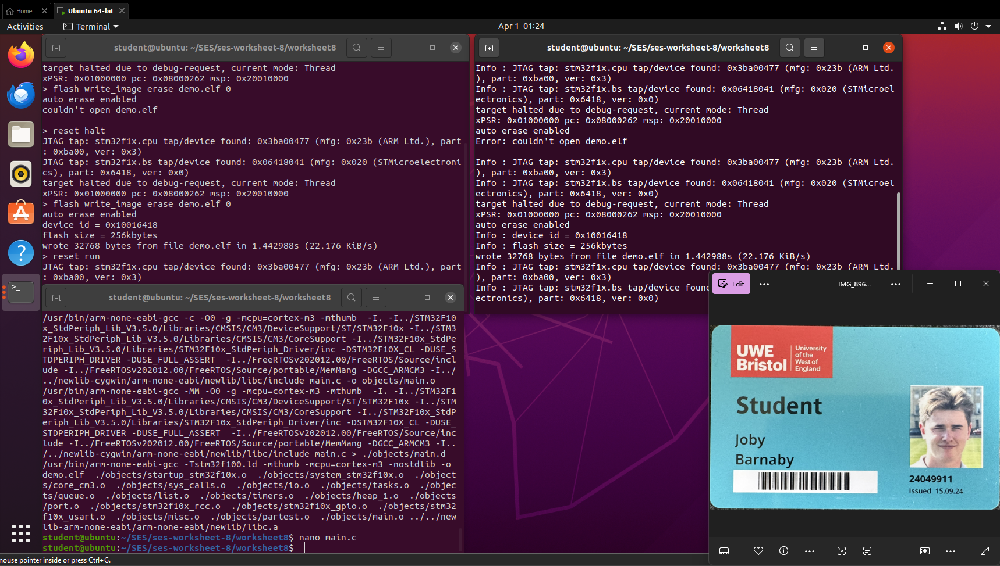
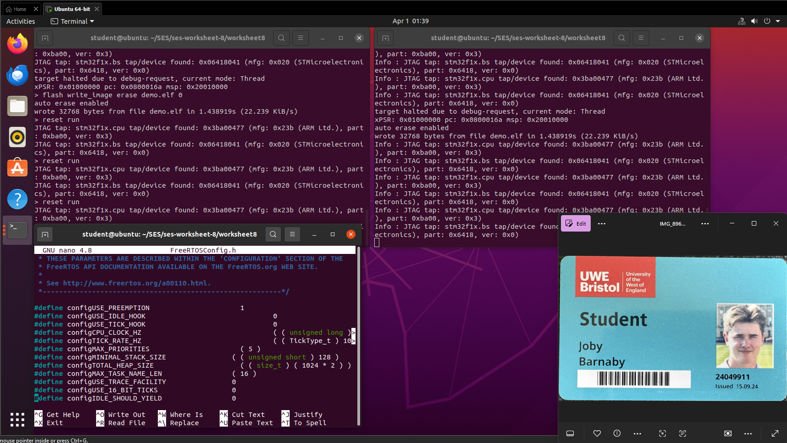
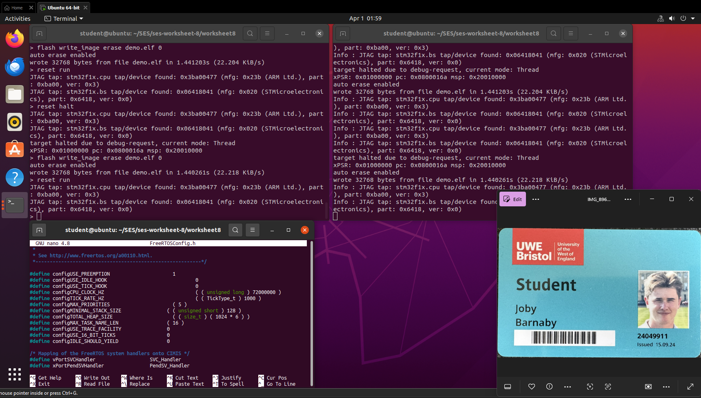
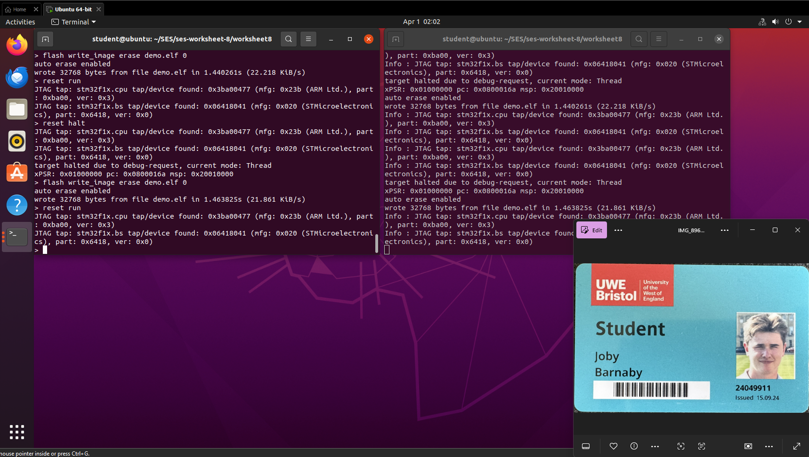
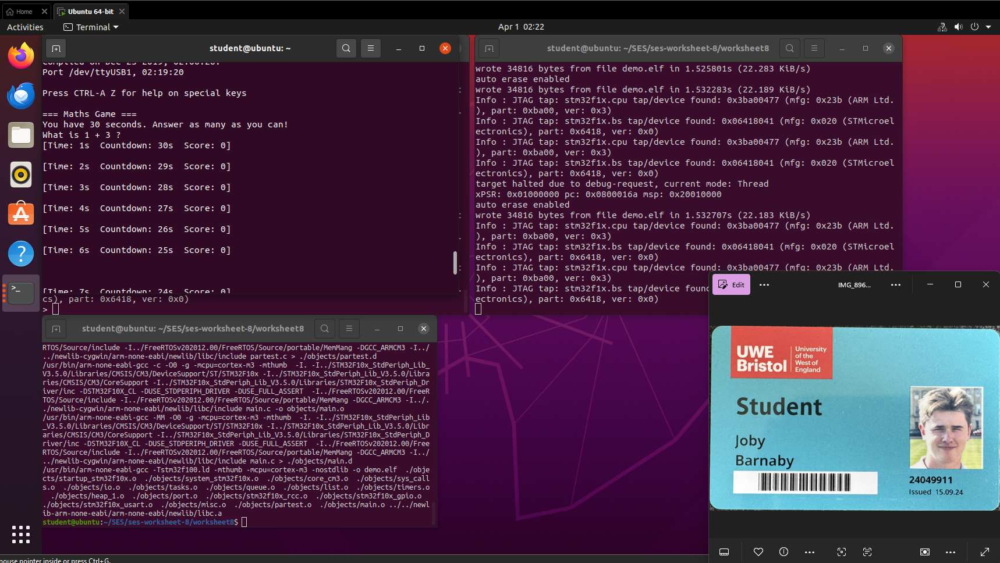

# ARM Cortex M3 | STM32F100 | Embedded Systems  
  
## Worksheet 8 — FreeRTOS on the Cortex M3  
  
**Student Name:** Joby Barnaby 
**Student ID:** 24049911

---
## Overview

This worksheet introduces FreeRTOS on the STM32F100 Cortex-M3. It covers task creation and scheduling, inter-task communication using shared variables, priority-based preemption, and two credit exercises: parameterised LED tasks and a multi-task maths game.

---

## Repository Setup
```
cd ~/SES
git clone https://gitlab.uwe.ac.uk/c-duffy/ses-worksheet-8.git
cd ses-worksheet-8
```

### FreeRTOS Source

Download and place alongside the worksheet directory:
```
wget http://sourceforge.net/projects/freertos/files/latest/download -O freertos.zip
unzip freertos.zip
```

The Makefile expects FreeRTOS at `../FreeRTOSv202012.00/FreeRTOS/Source`. Update this path if your version differs.

### Makefile Variables to Check
```makefile
FreeRTOS = ../FreeRTOSv202012.00/FreeRTOS/Source
LDLIBS += ../../newlib-arm-none-eabi/arm-none-eabi/newlib/libc.a
LDLIBS += /usr/lib/gcc/arm-none-eabi/9.2.1/libgcc.a
```

---

## Build & Flash Workflow

**Build:**
```bash
make clean
make
```

**Terminal 1 — Start OpenOCD:**
```bash
openocd -f openocd.cfg
```

**Terminal 2 — Flash:**
```bash
telnet localhost 4444
reset halt
flash write_image erase demo.elf 0
reset run
```

---

## Exercise 1 — Two LED Tasks

### Description

The intro demo creates two tasks that flash the two LEDs at different rates using vTaskDelay.

### Code
```c
void vGreenToggleTask(void *pvParameters)
{
    for (;;)
    {
        vParTestToggleLED(0);
        vTaskDelay( 3000 / portTICK_PERIOD_MS );
    }
}

void vOrangeToggleTask(void *pvParameters)
{
    for (;;)
    {
        vParTestToggleLED(1);
        vTaskDelay( 1500 / portTICK_PERIOD_MS );
    }
}

int main(void)
{
    vParTestInitialise();
    xTaskCreate( vGreenToggleTask,  "GreenLedToggle",  128, NULL, tskIDLE_PRIORITY + 1, NULL );
    xTaskCreate( vOrangeToggleTask, "OrangeLedToggle", 128, NULL, tskIDLE_PRIORITY + 1, NULL );
    vTaskStartScheduler();
    for (;;) {}
}
```

### Explanation

Both tasks are infinite loops — FreeRTOS tasks must never return. vTaskDelay() suspends the task for the given number of ticks, yielding the CPU to other tasks. The green LED toggles every 3 seconds, the orange every 1.5 seconds.

### Result

Both LEDs flash independently at different rates with no polling in the main loop.




---

## Exercise 2 — Changing Speeds and Priorities

### Description

Modify task delays to change flash rates. Adjust priorities to observe preemption and demonstrate starvation.

### Demonstrating Starvation
```c
#define mainGREEN_LED_TOGGLE    ( tskIDLE_PRIORITY + 3 )
#define mainORANGE_LED_TOGGLE   ( tskIDLE_PRIORITY + 1 )
```

If the high-priority task never calls vTaskDelay(), the lower-priority task never runs.

### Result

With equal priorities both LEDs flash. With a high-priority task that never blocks, the lower-priority LED stops entirely — demonstrating starvation. I stuggled to get a video of this as the yellow flashed on and off so quickly when running `reset run`




---

## Exercise 3 — Button Tasks with Shared Variables

### Description

Add tasks for the WKUP (PA0) and TAMPER (PC13) buttons. Button tasks set shared variables that LED tasks read to decide whether to flash.

### Code
```c
volatile int green_enabled  = 1;
volatile int orange_enabled = 1;

void vWKUPTask(void *pvParameters)
{
    for (;;)
    {
        if (GPIO_ReadInputDataBit(GPIOA, GPIO_Pin_0) == Bit_SET)
        {
            green_enabled = !green_enabled;
            vTaskDelay( 200 / portTICK_PERIOD_MS );
        }
        vTaskDelay( 50 / portTICK_PERIOD_MS );
    }
}
```

### Explanation

Shared variables are marked volatile to prevent the compiler caching them across context switches. Button tasks poll every 50 ms with a 200 ms debounce delay after a press.

### Result

Pressing WKUP toggles the green LED on/off. Pressing TAMPER toggles the orange LED on/off. All four tasks run concurrently.




---

## Credit Exercise — Parameterised LED Task

### Description

Refactor the two LED tasks into one function that accepts LED number and delay as parameters.

### Code
```c
typedef struct {
    int        led_number;
    TickType_t delay_ms;
} LedTaskParams_t;

void vLedToggleTask(void *pvParameters)
{
    LedTaskParams_t *params = (LedTaskParams_t *)pvParameters;
    for (;;)
    {
        vParTestToggleLED(params->led_number);
        vTaskDelay( params->delay_ms / portTICK_PERIOD_MS );
    }
}

static LedTaskParams_t greenParams  = { 0, 1000 };
static LedTaskParams_t orangeParams = { 1,  500 };
```

### Explanation

A struct holds per-task parameters passed via the pvParameters void pointer. Structs must be static or global — stack-allocated structs would go out of scope.

### Result

Both LEDs flash at different rates from a single task function, demonstrating parameterised FreeRTOS tasks.




---

## Credit Exercise — Multi-Task Maths Game

### Description

Rewrite the Worksheet 6 maths game with three concurrent tasks: game logic, clock display, and countdown timer.

| Task | Priority | Responsibility |
|------|----------|----------------|
| vClockTask | IDLE + 3 | Displays elapsed time every second |
| vCountdownTask | IDLE + 2 | Counts down; signals game over at zero |
| vMathsGameTask | IDLE + 1 | Presents questions and reads UART responses |

### Result

The maths game runs with a live clock and countdown updating in the background, demonstrating concurrent tasks communicating through shared state.




---

## Key Concepts

### Why Tasks Must Never Return

If a task function returns, the behaviour is undefined — typically a hard fault. Use vTaskDelete(NULL) if a task needs to terminate itself.

### vTaskDelay vs. Polling

vTaskDelay() yields the CPU for the delay period. A busy-wait loop blocks the CPU entirely, starving lower-priority tasks.

### volatile and Shared Variables

Variables shared between tasks must be volatile to prevent compiler register caching. For complex shared structures, use a mutex or critical section.

### Stack Depth

usStackDepth is in words, not bytes. On Cortex-M3, depth 128 = 512 bytes. Too little stack causes overflow — caught at runtime if configCHECK_FOR_STACK_OVERFLOW = 2.

---

## Final Conclusion

FreeRTOS was successfully run on the STM32F100 Cortex-M3. The exercises progressed from the two-LED intro demo through priority starvation, button tasks with shared variables, parameterised task functions, and a multi-task maths game. The key lesson was that vTaskDelay() is the correct delay mechanism in an RTOS — not polling loops. A possible improvement would be replacing shared volatile variables with FreeRTOS queues or semaphores for safer inter-task communication.